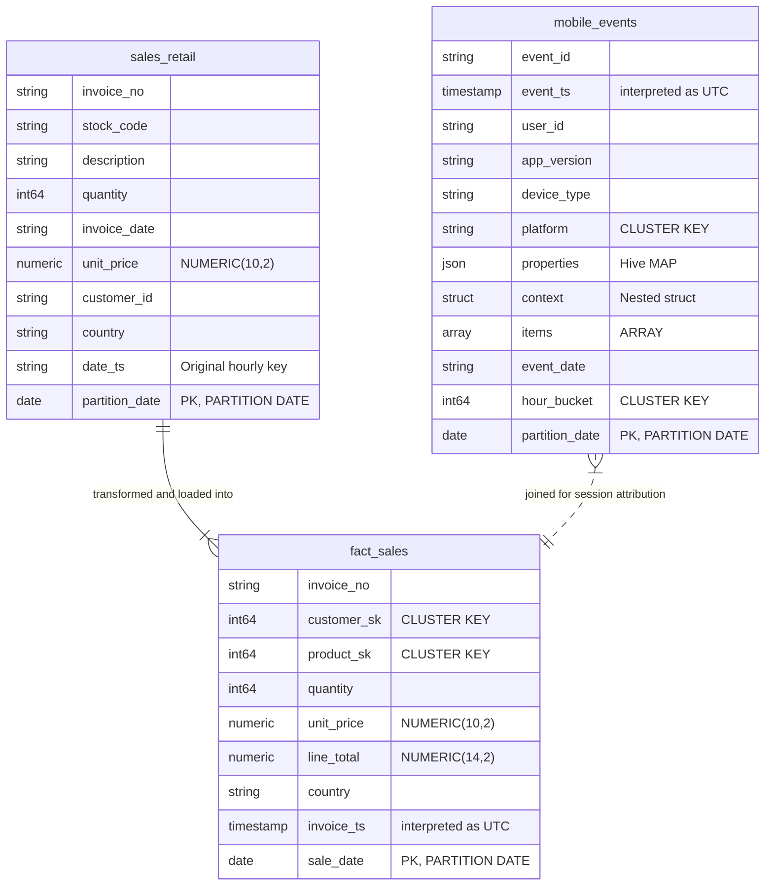

# Locked Decisions for Story e02001e6-8fef-4ff9-96e4-c2269c926a2c

## Implementation Approach
Build a robust, production-grade Python deployment script (`/workspace/project/scripts/deploy_ddl.py`) to manage the schema conversion deployment lifecycle.

### Summary of Technical Choices
- **Dataset Orchestration**: The script automatically checks for and creates target BigQuery datasets across two separate projects, enforcing geographic placement rules:
  - `PROJECT_US` (`acme-analytics`): Enforces `US` multi-region for `raw`, `staging`, `retail`, and `udfs` datasets.
  - `PROJECT_EU` (`acme-analytics-eu`): Enforces `EU` multi-region for `regional_eu` and `udfs` datasets.
- **Dynamic Variable Substitution**: The script dynamically loads variable templates from `/workspace/project/ddl/variables.env`, parses SQL statements, replaces placeholder strings (e.g. `${PROJECT_US}`, `${DS_RAW}`, `${DS_RETAIL}`) with environment-substituted values, and executes them as legacy-free standard SQL query jobs.
- **Dependency Ordering**: Deploy tables before views, following `/workspace/project/ddl/deploy_order.txt` topological sort sequence.
- **UDF Registration Integration**: Registers standard JS and remote UDFs using pre-configured target connection locations. Handles potential remote-connection/function dependency gaps.

## Data Mapping
The data mapping strategy defines the structural transformation of all 82 tables from Cloudera Hive schema definitions into optimized Google Cloud BigQuery structures.

### 1. Database Entity Relationship Diagram (Representative Core)

### 2. Column & Data Type Translation Matrix

| Cloudera Source Type | BigQuery Target Type | Translation Logic | Risk Mitigated / Rationale |
|---|---|---|---|
| `TINYINT`, `SMALLINT`, `INT`, `BIGINT` | `INT64` | Standard widening | Prevents numeric overflow. |
| `BOOLEAN` | `BOOL` | Direct translation | Native compliance. |
| `DECIMAL(p, s)` | `NUMERIC(p, s)` | Fixed-point numeric | Avoids IEEE-754 binary floating-point rounding errors during financial close. |
| `MAP<STRING, STRING>` | `JSON` | Native JSON | Preserves flexible, dynamic schema properties; queryable via `JSON_VALUE()`. |
| `ARRAY<STRUCT<...>>` | `ARRAY<STRUCT<...>>` | Native nested array | Preserves original repeated structure. |
| `STRUCT<...>` | `STRUCT<...>` | Native structure | Preserves hierarchical details. |
| Naive `TIMESTAMP` | `TIMESTAMP` | Interpret as UTC | Establishes uniform timezone reference across multi-cluster systems. |

### 3. Partition & Cluster Redesign

- **Hourly Partition Keys (`yyyyMMdd_HH`)**: Collapsed to daily DATE partitions to prevent hitting BigQuery's 4,000 partition limit (which would exhaust partition capacity in ~11 years). The original string hourly partition key is preserved as a regular column for backward query compatibility.
- **Multi-column Partitioning**: Restructured into single-column partitioning by target DATE, moving secondary partition keys to `CLUSTER BY` fields (up to 4 columns).
- **Hive Bucketing**: Bucketing options (e.g., `INTO 16 BUCKETS`) are dropped. Target columns are migrated to native BigQuery `CLUSTER BY` lists, allowing Google Cloud to auto-manage block sizing dynamically.
- **Require Partition Filter**: Enforced (`require_partition_filter = TRUE`) on 11 highly critical/high-volume tables to avoid accidental full table scans.

## Validation
The validation strategy establishes a automated, dual-layer post-deployment audit mechanism inside `/workspace/project/scripts/deploy_ddl.py` to confirm structural, dialect, and syntactic parity across the entire BigQuery topology.

### 1. Verification Layers

- **Layer 1: Structural Audit via INFORMATION_SCHEMA**:
  - Immediately following schema creation, the deployment script queries target metadata via `INFORMATION_SCHEMA.TABLES`, `INFORMATION_SCHEMA.COLUMNS`, and `INFORMATION_SCHEMA.PARTITIONS`.
  - Audits actual partition fields (e.g. `partition_date` exists and is formatted as native `DATE`), clustering configurations, and explicit types (e.g. verifying `MAP` columns resolved to native `JSON` and `DECIMAL` fields mapped to exact fixed-precision `NUMERIC` types).
  - Asserts that all 100 tables exist across the US (`raw`, `staging`, `retail`, `udfs`) and EU (`regional_eu`, `udfs`) datasets.

- **Layer 2: View Dialect & Compilation Dry-Run Verification**:
  - Executes dry-run query jobs for all 15 converted BigQuery views (e.g., `vw_panel_continuity_score`, `v_eu_orders_with_consent`, `vw_session_to_order_attribution`).
  - By using BigQuery's dry-run feature (`dry_run = True` on query jobs), the script tests syntactic validity, checks for translated function compatibility (e.g., `DATE_DIFF`, `APPROX_COUNT_DISTINCT`, `FORMAT_DATE`), and validates cross-dataset references without reading/billing scanned bytes.

### 2. Failure Handling
- If any table fails the `INFORMATION_SCHEMA` structure check, or if a view dry-run throws a compile-time SQL execution error (due to broken dependencies, invalid function calls, or dataset location conflicts), the script raises a verbose schema validation exception, lists the faulty schemas, and exits with a non-zero exit code to halt automated CI/CD pipeline triggers.
