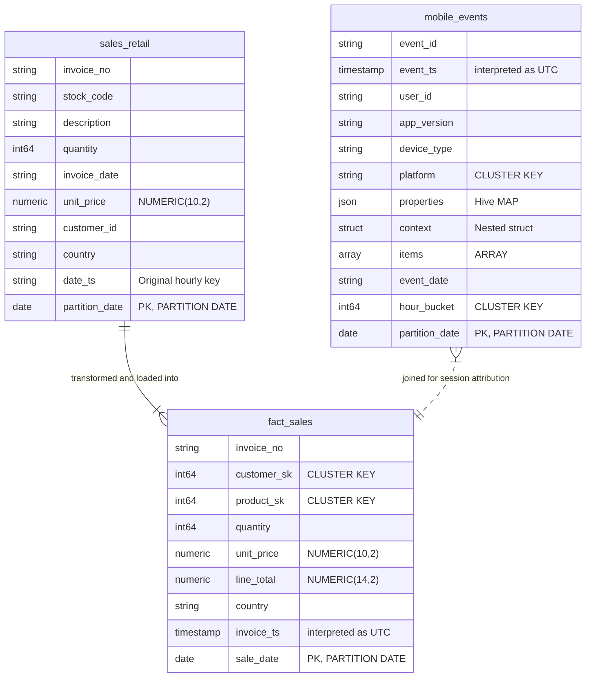

# Data Mapping

The data mapping strategy defines the structural transformation of all 82 tables from Cloudera Hive schema definitions into optimized Google Cloud BigQuery structures.

### 1. Database Entity Relationship Diagram (Representative Core)

### 2. Column & Data Type Translation Matrix

| Cloudera Source Type | BigQuery Target Type | Translation Logic | Risk Mitigated / Rationale |
|---|---|---|---|
| `TINYINT`, `SMALLINT`, `INT`, `BIGINT` | `INT64` | Standard widening | Prevents numeric overflow. |
| `BOOLEAN` | `BOOL` | Direct translation | Native compliance. |
| `DECIMAL(p, s)` | `NUMERIC(p, s)` | Fixed-point numeric | Avoids IEEE-754 binary floating-point rounding errors during financial close. |
| `MAP<STRING, STRING>` | `JSON` | Native JSON | Preserves flexible, dynamic schema properties; queryable via `JSON_VALUE()`. |
| `ARRAY<STRUCT<...>>` | `ARRAY<STRUCT<...>>` | Native nested array | Preserves original repeated structure. |
| `STRUCT<...>` | `STRUCT<...>` | Native structure | Preserves hierarchical details. |
| Naive `TIMESTAMP` | `TIMESTAMP` | Interpret as UTC | Establishes uniform timezone reference across multi-cluster systems. |

### 3. Partition & Cluster Redesign

- **Hourly Partition Keys (`yyyyMMdd_HH`)**: Collapsed to daily DATE partitions to prevent hitting BigQuery's 4,000 partition limit (which would exhaust partition capacity in ~11 years). The original string hourly partition key is preserved as a regular column for backward query compatibility.
- **Multi-column Partitioning**: Restructured into single-column partitioning by target DATE, moving secondary partition keys to `CLUSTER BY` fields (up to 4 columns).
- **Hive Bucketing**: Bucketing options (e.g., `INTO 16 BUCKETS`) are dropped. Target columns are migrated to native BigQuery `CLUSTER BY` lists, allowing Google Cloud to auto-manage block sizing dynamically.
- **Require Partition Filter**: Enforced (`require_partition_filter = TRUE`) on 11 highly critical/high-volume tables to avoid accidental full table scans.
